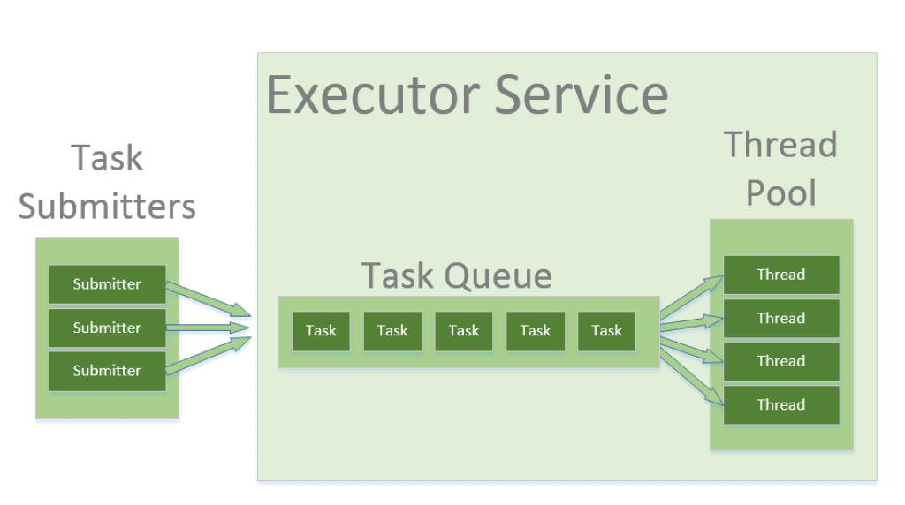

# Thread Pools in Java

## 1. What Is a Thread Pool?

A **thread pool** is a collection of **pre-created, reusable threads** managed by the JVM.

Instead of creating a new thread for every task:

* Threads are **created once**
* Tasks are **submitted to the pool**
* Idle threads **pick up tasks**
* Threads are **reused**, not destroyed

This is implemented in Java using the **Executor Framework** (`java.util.concurrent`).

---

## 2. Why Thread Pools Are Needed

Creating and destroying threads repeatedly is **expensive**.

### Problems with Manual Thread Creation

```java
new Thread(task).start();
```

Issues:

* High memory usage
* Slow thread creation
* Too many threads → context switching overhead
* Possible `OutOfMemoryError`
* No lifecycle management

---

### Benefits of Thread Pools

* Reduced thread creation overhead
* Better CPU utilization
* Controlled concurrency
* Improved performance and scalability
* Centralized thread management
* Built-in task queuing

---

## 3. Executor Framework

Java introduced the **Executor Framework** in Java 5.

Key interfaces and classes:

```
Executor
   ↓
ExecutorService
   ↓
ThreadPoolExecutor
```

---

### 3.1 Executor Interface

```java
public interface Executor {
    void execute(Runnable command);
}
```

It separates **task submission** from **task execution**.

---

### 3.2 ExecutorService Interface

Adds lifecycle management:

* Submit tasks
* Shutdown pool
* Track task completion

Common methods:

```java
submit()
shutdown()
shutdownNow()
isShutdown()
isTerminated()
```

---

## 4. How a Thread Pool Works (Internals)



Key components inside a thread pool:

* **Worker threads**
* **Task queue**
* **Thread factory**
* **Rejection policy**

---

## 5. Creating Thread Pools in Java

Java provides factory methods via `Executors` class.


### 5.1 Fixed Thread Pool

```java
ExecutorService executor =
        Executors.newFixedThreadPool(5);
```

### Characteristics:

* Fixed number of threads
* Tasks wait in queue if all threads are busy
* Threads are reused

### Use Case:

* CPU-bound tasks
* Stable number of concurrent requests

---

### 5.2 Cached Thread Pool

```java
ExecutorService executor =
        Executors.newCachedThreadPool();
```

### Characteristics:

* Creates new threads as needed
* Reuses idle threads
* No upper bound on threads

### Use Case:

* Short-lived, lightweight tasks
* I/O-bound tasks

### Risk:

* Can create too many threads → memory issues

---

### 5.3 Single Thread Executor

```java
ExecutorService executor =
        Executors.newSingleThreadExecutor();
```

### Characteristics:

* One worker thread
* Tasks executed sequentially
* Maintains order

### Use Case:

* Logging
* Sequential background tasks

---

### 5.4 Scheduled Thread Pool

```java
ScheduledExecutorService scheduler =
        Executors.newScheduledThreadPool(2);
```

### Scheduling Tasks:

```java
scheduler.schedule(task, 5, TimeUnit.SECONDS);
scheduler.scheduleAtFixedRate(task, 0, 5, TimeUnit.SECONDS);
```

### Use Case:

* Timers
* Periodic background jobs

---

## 6. Submitting Tasks to Thread Pool

### 6.1 Using `execute()` (Runnable)

```java
executor.execute(() -> {
    System.out.println(Thread.currentThread().getName());
});
```

* No return value
* Fire-and-forget tasks

---

### 6.2 Using `submit()` (Callable / Runnable)

```java
Future<Integer> result =
        executor.submit(() -> 10 + 20);
```

* Returns a `Future`
* Can retrieve result or exception

```java
Integer value = result.get();
```

---

## 7. Callable vs Runnable in Thread Pools

| Runnable                       | Callable                    |
| ------------------------------ | --------------------------- |
| No return value                | Returns a value             |
| Cannot throw checked exception | Can throw checked exception |
| `execute()` / `submit()`       | `submit()`                  |

---

## 8. Shutting Down a Thread Pool

Thread pools **must be shut down** properly.

### 8.1 Graceful Shutdown

```java
executor.shutdown();
```

* Stops accepting new tasks
* Completes existing tasks

### 8.2 Force Shutdown

```java
executor.shutdownNow();
```

* Attempts to stop running tasks
* Interrupts threads
* Returns pending tasks

### 8.3 Proper Shutdown Pattern

```java
executor.shutdown();
try {
    if (!executor.awaitTermination(10, TimeUnit.SECONDS)) {
        executor.shutdownNow();
    }
} catch (InterruptedException e) {
    executor.shutdownNow();
}
```

---

## 9. Thread Pools vs Manual Threads

| Feature          | Thread Pool | Manual Threads |
| ---------------- | ----------- | -------------- |
| Thread reuse     | Yes         | No             |
| Resource control | Yes         | No             |
| Performance      | High        | Low            |
| Scalability      | High        | Poor           |
| Error handling   | Centralized | Scattered      |

---

## 10. Common Thread Pool Problems

* Creating too many threads
* Forgetting to shut down pool
* Using cached pool blindly
* Blocking tasks in small pools
* Wrong pool size for workload

---

## 11. Choosing the Right Pool Size

### CPU-bound tasks

```
Pool size ≈ Number of CPU cores
```

### I/O-bound tasks

```
Pool size > Number of CPU cores
```

Rule of thumb:

```text
Threads = CPU cores * (1 + wait time / compute time)
```

---

## 12. Real-World Usage

* Web servers (Tomcat, Spring Boot)
* Database connection handling
* Async processing
* Background jobs
* Message consumers

---

## 13. Interview Questions

### Q1. What is a thread pool?

A collection of reusable threads that execute submitted tasks.

---

### Q2. Why use thread pools?

To reduce thread creation overhead and improve performance.

---

### Q3. Difference between `execute()` and `submit()`?

`execute()` → no result
`submit()` → returns `Future`

---

### Q4. What happens if a thread pool is not shut down?

JVM may not terminate; memory leaks occur.

---

### Q5. What is corePoolSize vs maxPoolSize?

* core → minimum threads
* max → upper limit during high load

---

### Q6. What is task rejection?

When pool cannot accept more tasks due to capacity limits.

---

### Q7. Which pool is best for CPU-bound tasks?

Fixed thread pool.

---

### Q8. Which pool is risky?

Cached thread pool (unbounded threads).

---

## Key Takeaways

* Thread pools reuse threads to improve performance

* ExecutorService manages lifecycle and execution

* Fixed, Cached, Single, and Scheduled pools serve different needs

* Proper shutdown is critical

* ThreadPoolExecutor gives full control

* Choosing correct pool size is essential for scalability

---
